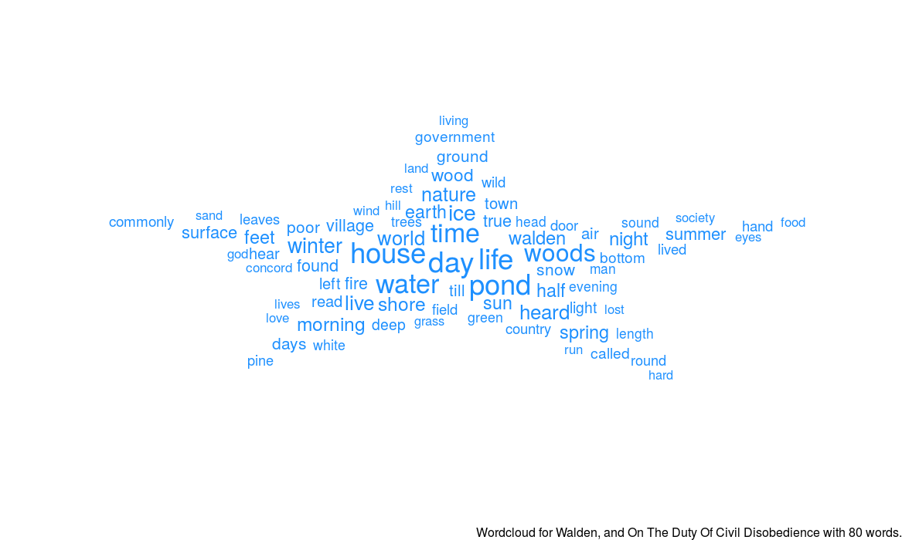
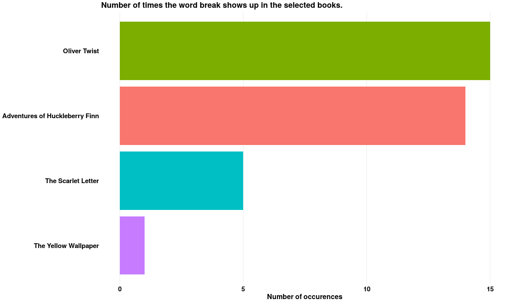

```{r setup, include=FALSE}
knitr::opts_chunk$set(echo = FALSE, warning = FALSE, message = FALSE)
```

Here is a brief introduction to our Shiny app which can be found here: [https://khanjian.shinyapps.io/Text_Analysis/](https://khanjian.shinyapps.io/Text_Analysis/)

## Introduction to Shiny App

*What's in a word* allows users to search within the `gutenbergR` package for books categorized as American and French literature to perform text analysis to further understand the contents of the books. On the home page you can search for a specific book to see if that book is in the database. If you are unsure of what book to search for, you can type in the word "random", and one of the top 50 most downloaded books will appear for you. Using the `tidytext` and `tidyverse` packages the app tokenizes a specified book and then wrangles the data to give a desired output. 

## Word Cloud

In the word cloud tab users are able to create a word cloud from their favorite book and choose a shape, number of words, and color. Below is a word cloud for the book *Walden, and On The Duty Of Civil Disobedience* by Henry David Thoreau. 

```{r}

```

## Word-Count

In this section, users have the option to compare how often a specific word shows up in up to four book. Below is a plot showing the frequency of the word "break" in four books. 

```{r}

```

## Sentiment Analysis

Using the bing or nrc lexicons, here users can see what word associated with certain sentiments appear in a book. The bing lexicon categorizes words into either positive or negative affect, while the nrc lexicon categorizes words into one of eight emotions, and as either positive or negative affect. Below is a plot of the top words associated with each emotion for the book *Moby Dick* by Herman Melville. 

```{r}
knitr::include_graphics("sentiment_analysis.png")
```

## Sentiment Trajectory

Lastly the sentiment trajectory tab allows users to see how sentiment changes as a novel progresses. Also users can change the moving average window used to see trends over longer periods throuhout the book. Here is a plot of the sentiment trajectory for *The Legend of Sleepy Hollow* by Washington Irving. 

```{r}
knitr::include_graphics("sentiment_trajectory.png")
```

Hope you enjoy using our app! If you would like to take a look at the source code, click on the github icon in our app. 

