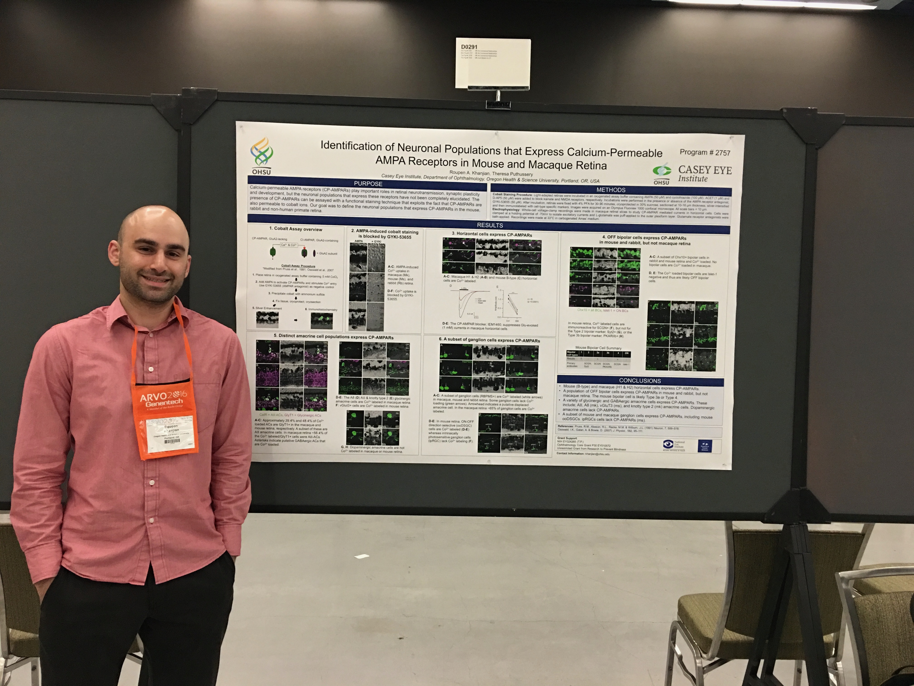

```{r setup, include=FALSE}
knitr::opts_chunk$set(echo = FALSE)
```


  I am currently working towards my Masters in Statistics degree from the University of California, Santa Barbara (UCSB), with an expected graduation date of June 2021. A critical part of the curriculum is analyzing data, using specific statistical methods including but not limited to regression analysis, big data analytics, and machine learning. Using R and python to wrangle and examine data, I am able to translate my results into applicable conclusions. Utilizing the ggplot2 and Shiny packages in Rstudio or the pandas and seaborn packages in Python I create dynamic visualizations to help summarize the data.  
  
In addition to completing coursework at UCSB, I am a teacher’s assistant (TA) for the Regression Analysis course, where I am responsible for teaching students’ how to conduct linear regression using R. I have also been a TA for the Principles of Data Science with R course, where I educated students on the fundamentals of programming in R and how to perform queries in SQL. Working as a teaching assistant has given me a strong foundation in statistical analysis and programming and has helped shape me into a patient, organized, and prompt individual.  

Prior to attending graduate school, I worked in numerous neuroscience laboratories as a research assistant. Most recently, I worked in Dr. Teresa Puthussery’s visual neuroscience laboratory, where my main independent project focused on locating Calcium-Permeable AMPA receptors in the retina using a variety of experimental techniques. At the 2016 ARVO annual meeting in Seattle, I presented a poster discussing our results.  

```{r, fig.cap= "Poster session from 2016 ARVO conference"}

```


My time working in research laboratories taught me how to troubleshoot in a stepwise manner and figure out how to deal with different obstacles throughout a project. Being aware of many facets important to the success of an experiment has trained me to be a good researcher with keen attention to detail. My experiences shaped me into a confident investigator and honed my critical decision making skills.  

Throughout my years as a student and working in multiple research laboratories, I learned that communication and teamwork are paramount in generating quality scientific research. I hope to apply the skills I have developed to help solve real-world research problems at OHSU.  


